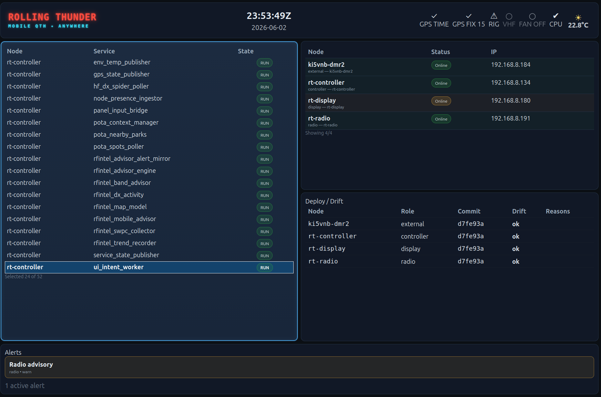
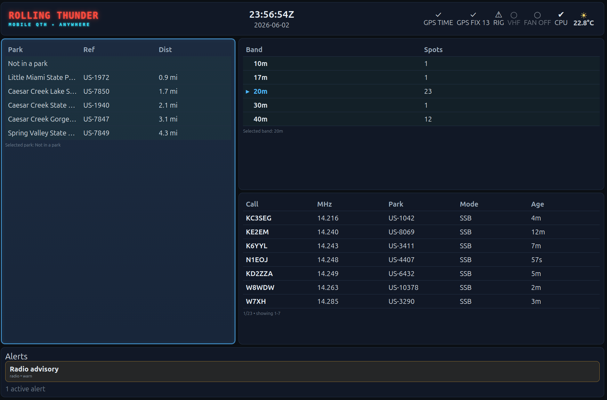
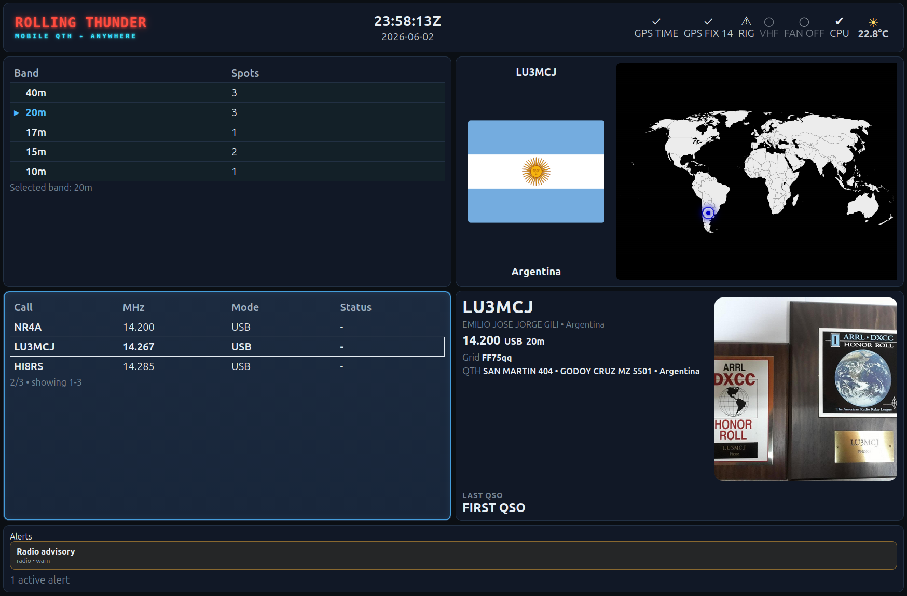
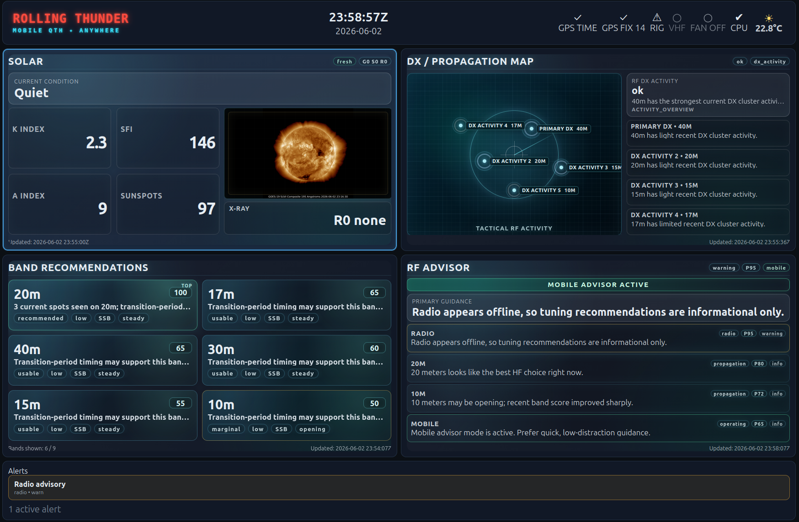
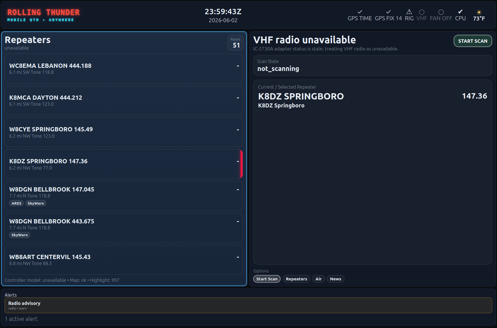

# RollingThunder

**RollingThunder** is a personal amateur radio operations platform built to bring mobile, field, and shack radio information together into one focused operating display.

The project began as a personal passion project to make my own radio operating environment more useful, more mobile-friendly, and more situationally aware. It has grown into a multi-node system that combines live radio status, GPS position, POTA support, HF operating intelligence, VHF repeater awareness, alerts, and system health into a controller-driven user interface.

RollingThunder is designed around one core idea:

> The operator should be able to glance at one display and immediately understand what the radio system is doing, what opportunities are available, and what needs attention.

## What RollingThunder Does

RollingThunder provides a dashboard-style operating environment for amateur radio use. It is intended for mobile operation, portable operation, and future shack integration.

Current capabilities include:

* A home page showing system, node, and service health
* A controller-owned UI state model with physical and virtual controls
* GPS-aware operating context
* POTA-oriented operating support
* HF band and spot information
* RF intelligence using solar, band, DX activity, and advisory data
* VHF repeater lookup and scan control framework
* Icom IC-2730A integration for VHF/UHF work
* External fan status monitoring on the radio node
* Alert overlay and advisory display
* Multi-node service status tracking
* Redis-backed state coordination
* A renderer-only web UI suitable for a dedicated display

RollingThunder is not intended to replace a logging program, a radio control suite, or a full station automation system. Instead, it acts as an operating companion: a purpose-built situational awareness and control surface for radio activity.

## Project Goals

RollingThunder is being built with several guiding principles:

* **Controller-owned state**
  The controller owns system state, page state, focus, browse state, alerts, and operator intent handling.

* **Renderer-only UI**
  The display does not make operating decisions. It renders projected state and emits operator intents.

* **Clean separation of responsibilities**
  Radio adapters own radio-specific behavior. Services publish data. The controller decides what to do with that data. The UI displays the result.

* **Mobile-first design**
  RollingThunder is intended to work well in a vehicle, with limited screen space, limited operator attention, and changing network/GPS conditions.

* **No unsafe radio behavior**
  The system avoids adding transmit/PTT control paths unless deliberately designed and reviewed. Radio control work is kept conservative and explicit.

* **Incremental, inspect-first development**
  The project has been built step by step, with a strong preference for understanding the current state before adding new code.

## Current Architecture

RollingThunder v1.0.0 is a distributed Raspberry Pi based system.

The current system uses several nodes:

* **rt-controller**
  Main controller node. Owns Redis state, UI interaction state, projection, service coordination, alerts, and most application logic.

* **rt-display**
  Dedicated display node running a browser-based UI in kiosk style.

* **rt-radio**
  Radio interface node connected to radio hardware such as the Icom IC-2730A. It handles radio-adjacent services and hardware status such as the external fan monitor.

* **rt-wpsd**
  Optional WPSD / digital voice related node.

The system uses:

* **Redis** for shared state and pub/sub events
* **Python services** for collectors, publishers, controllers, adapters, and model builders
* **systemd** for service management
* **A browser-based UI** for the display layer
* **JSON configuration** for pages, panels, and UI layout
* **SQLite** for some local data stores such as repeater data or trend/history data
* **Node-specific service publishers** to report systemd service status into Redis

## UI Model

RollingThunder uses a controller-projected UI model.

The browser UI does not directly scan Redis, discover services, call APIs, or command radios. Instead:

1. Backend services publish state into Redis.
2. Controller services interpret that state.
3. The UI state projector publishes a clean display model.
4. The browser renders the projected model.
5. Physical or virtual controls publish operator intents.
6. The controller decides what those intents mean.

This keeps the UI “dumb” by design and allows the display technology to change later without rewriting the operating logic.

## Radio and Operating Features

RollingThunder currently includes or is being developed around these operating areas:

### Home / System Health

The home page provides a quick view of nodes, services, and alerts. It is intended to be the safe landing page for the system.

### POTA Page

The Parks On The Air (POTA) page shows current SSB activators you can select to work.  It also alerts if within 7 miles of a POTA site in the US.
* The POTA Park information does not automatically update

### HF Page

The HF page provides band and spot-oriented information to help the operator understand what activity is available and where attention may be useful.

### RF Intel

The RF Intel page combines solar and band-condition information with advisory logic. It is intended to help answer questions such as:

* Are bands improving or fading?
* Is 10 meters opening?
* Is 40 meters becoming more useful for domestic contacts?
* Are solar or geomagnetic conditions affecting operation?

### VHF / UHF

The VHF page is focused on repeater awareness and mobile VHF operation. It includes nearby repeater data, scan state, radio availability, and support for the Icom IC-2730A control path.

### Alerts

RollingThunder includes an alert overlay model so important system or operating advisories can be surfaced without permanently taking over the display.

## Version 1.0.0 Status

Version 1.0.0 represents the first stable personal checkpoint of the RollingThunder project.

It includes the core architecture, multi-node service visibility, controller-owned UI interaction model, RF Intel framework, HF/VHF page structure, and radio-node integration work.

This version should be considered a working personal milestone, not a commercial product or general-purpose packaged application.

## Future Direction

RollingThunder v2 will likely move away from the current multi-Raspberry-Pi layout toward a single environmentally hardened hardware platform.

The likely direction for version 2 includes:

* A single industrial or ruggedized computer
* Better tolerance for vehicle temperature, vibration, and power conditions
* Containerized services
* Cleaner deployment and backup strategy
* More formal radio adapter boundaries
* Improved offline map and GPS support
* More complete HF, VHF, POTA, APRS, DMR, and station integration
* Easier recovery, restore, and version management

The current distributed Raspberry Pi design has been extremely useful for development and learning. A future consolidated hardware platform should make the system easier to install, operate, and maintain in a mobile radio environment.

## Personal Project Note

RollingThunder is a personal passion project.

It is being built by and for an amateur radio operator who wanted a better way to combine radio status, operating opportunities, environmental information, GPS context, and system health into a single practical display.

The project reflects real operating needs, field experience, mobile radio experimentation, and a strong interest in building reliable radio tools one step at a time.

## Disclaimer

RollingThunder is experimental software.

Use it at your own risk. Radio control, mobile operation, electrical wiring, and vehicle-installed electronics all require care, testing, and good judgment.

The project is intended to assist an operator, not replace operator responsibility.
