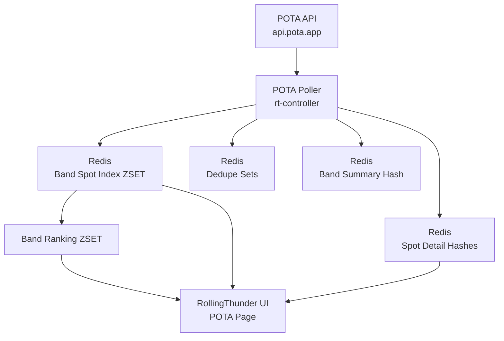
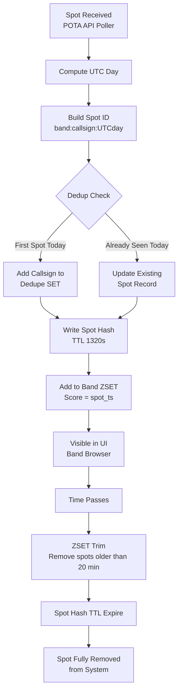

# RollingThunder POTA Data Model #

**Version:** 0.3100
**Subsystem:** POTA Spot Ingestion and UI Browsing
**Applies To:** rt-controller POTA poller and Redis state model

---

## Overview ##
RollingThunder periodically polls the **POTA API** for activator spots and stores a **short-lived operational view** of those spots in Redis for use by the RollingThunder UI.

The goal of this model is to provide:
 - Efficient UI browsing of active POTA spots
 - Automatic aging of stale spots
 - Deduplication of spots by activator/band/day
 - Minimal Redis write churn
 - Fast band summary queries

This data model intentionally stores only the **active operating window**, not long-term history.

---

## Time Semantics ##

RollingThunder follows the same convention used by POTA logging:

**All timestamps and day calculations use UTC.**

### Rules ###
 1. All timestamps are stored as **Unix seconds (UTC)**.
 2. The definition of a **day** is the **UTC** day (`YYYYMMDD`).
 3. Deduplication boundaries are based on the **UTC day**.
 4. Redis keys containing dates always use the UTC date.

Example:
```
2026-03-04 23:58 UTC → day key = 20260304
2026-03-05 00:02 UTC → day key = 20260305
```

---

## Active Spot Window ##
RollingThunder only tracks **recent spots.**

Active window:
```
20 minutes (1200 seconds)
```
This window is enforced via:
 - Redis **ZSET score trimming**
 - Redis **TTL expiration of spot hashes**

---

## Redis Key Structure ##
### Spot Detail (Expiring Hash) ###
Stores the most recent information for a deduplicated spot.
```
rt:pota:ssb:spot:<band>:<callsign>:<UTCday>
```
Example:
```
rt:pota:ssb:spot:20m:K1ABC:20260304
```
Type:
```
HASH
```
TTL:
```
1320 seconds (~22 minutes)
```
Fields:
```
callsign
band
freq_khz
mode
reference
park_name
grid4
grid6
latitude
longitude
spot_ts
comment
source
```
Purpose:
  - Provide detailed data for UI display
  - Expire automatically after the spot window

---

## Band Spot Index ##
Tracks the active spot window for each band.

Key:
```
rt:pota:ssb:spots:<band>
```
Example:
```
rt:pota:ssb:spots:20m
```
Type:
```
ZSET
```
Score:
```
spot_ts (unix time)
```
Member:
```
spot_id = <band>:<callsign>:<UTCday>
```
Example member:
```
20m:K1ABC:20260304
```
Purpose:
  - Efficient UI browsing
  - Sorted by most recent spot

---

## Aging Strategy ##
Stale spots are removed by trimming the ZSET.

Operation:
```
ZREMRANGEBYSCORE rt:pota:ssb:spots:<band> -inf (now-1200)
```
Where:
```
1200 seconds = 20 minute window
```
Spot hashes expire automatically via TTL.
This dual mechanism prevents dangling index references.

---

## Deduplication ##
Spots are deduplicated by:
```
callsign + band + UTC day
```
Redis key:
```
rt:pota:ssb:dedupe:<UTCday>:<band>
```
Example:
```
rt:pota:ssb:dedupe:20260304:20m
```
Type:
```
SET
```
Members:
```
<callsign>
```
Example:
```
K1ABC
W8XYZ
```
TTL:
```
172800 seconds (48 hours)
```
Purpose:
  - Prevent repeated spot processing
  - Maintain daily dedupe boundaries

---

## Band Summary ##
Stores quick band-level status for UI display.

Key:
```
rt:pota:ssb:band:<band>
```
Example:
```
rt:pota:ssb:band:20m
```
Type:
```
HASH
```
Fields:
```
active_count
last_spot_ts
last_poll_ts
```
Purpose:
  - Efficient UI band summary
  - Avoid repeated ZSET scans

---

## Band Ranking ##
Tracks bands ordered by most recent activity.

Key:
```
rt:pota:ssb:bands
```
Type:
```
ZSET
```
Score:
```
last_spot_ts
```
Member:
```
<band>
```
Example:
```
20m
17m
15m
```
Purpose:
  - Fast UI band ordering
  - Activity-based navigation

---

## UI Query Pattern ##
**Band List (Left Panel)**
1. ```ZREVRANGE rt:pota:ssb:bands 0 -1```
2. ```HMGET rt:pota:ssb:band:<band> active_count last_spot_ts```

---

## Spot List (Right Panel) ##
1. ```ZREVRANGE rt:pota:ssb:spots:<band> 0 50```
2. ```HGETALL rt:pota:ssb:spot:<spot_id>```

Pipeline recommended.

---

## Poller Processing Flow ##
For each incoming spot:
1. Compute UTC day.
```
day = YYYYMMDD (UTC)
```
2. Build identifiers.
```
spot_id = <band>:<callsign>:<day>
```
3. Deduplicate.
```
SADD rt:pota:ssb:dedupe:<day>:<band> <callsign>
```
4. Update spot detail.
```
HSET rt:pota:ssb:spot:<spot_id> ...
EXPIRE rt:pota:ssb:spot:<spot_id> 1320
```
5. Add to band index.
```
ZADD rt:pota:ssb:spots:<band> <spot_ts> <spot_id>
```
6. Trim expired spots.
```
ZREMRANGEBYSCORE rt:pota:ssb:spots:<band> -inf (now-1200)
```

---

## Design Goals ##
This model was designed to achieve:
- **O(log n)** writes
- **O(1) band summary lookups**
- **Fast UI paging**
- **Minimal Redis memory churn**
- **Automatic cleanup**

The system maintains **only the active POTA operating window** and intentionally avoids storing historical archives.

---

## Future Extensions ##
Possible enhancements:
  - Mode-specific partitions (CW / FT8 / SSB)
  - Activator statistics
  - Park activity ranking
  - Signal strength aggregation
  - Cross-node spot sharing

These should not violate the core constraints:
```
Short-lived state
UTC semantics
band-index browsing
```

---

## Architecture Diagram ##
The POTA subsystem follows a simple ingestion → state → UI model.



---

## Data Flow Explanation ##
**1. Spot Ingestion**

The **POTA Poller** periodically retrieves spots from:
```
https://api.pota.app/spot/activator
```
For each spot the poller:
- Computes the UTC day
- Performs deduplication
- Updates Redis spot state

---

**2. Redis State Model**

Redis stores short-lived operational state in four structures.

**Spot Detail (Hash)**
```
rt:pota:ssb:spot:<band>:<callsign>:<UTCday>
```
Purpose:
- Full spot data for UI display
- Automatically expires after ~22 minutes

---

**Band Spot Index (ZSET)**
```
rt:pota:ssb:spots:<band>
```
Score:
```
spot_ts
```
Purpose:
- Maintain the **20-minute active window**
- Provide **sorted browsing by time**

---

**Deduplication (SET)**
```
rt:pota:ssb:dedupe:<UTCday>:<band>
```
Purpose:
- Ensure activators appear once per band per UTC day

---

**Band Summary (HASH)**
```
rt:pota:ssb:band:<band>
```
Fields:
```
active_count
last_spot_ts
last_poll_ts
```
Purpose:
- Quick UI band summary

---

**Band Ranking (ZSET)**
```
rt:pota:ssb:bands
```
Score:
```
last_spot_ts
```
Purpose:
- Allow the UI to quickly list **active bands ordered by activity**

---

## UI Query Flow ##

When the RollingThunder UI POTA page loads:

**Step 1 — Band List**
```
ZREVRANGE rt:pota:ssb:bands
```
Then:
```
HMGET rt:pota:ssb:band:<band>
```
This populates the **left-side band selector.**

---

**Step 2 — Spot List**

For the selected band:
```
ZREVRANGE rt:pota:ssb:spots:<band> 0 50
```
Then:
```
HGETALL rt:pota:ssb:spot:<spot_id>
```
This populates the **right-side spot browser.**

---

**Aging Mechanism**

Two mechanisms ensure stale data disappears automatically.

**ZSET trimming**
```
ZREMRANGEBYSCORE rt:pota:ssb:spots:<band> -inf (now-1200)
```
Removes spots older than **20 minutes.**
---
**Hash expiration**
```
EXPIRE rt:pota:ssb:spot:<spot_id> 1320
```
Removes spot detail after **~22 minutes.**

---
## System Design Philosophy ##

The RollingThunder POTA model intentionally follows these rules:
```
Short-lived operational state
UTC time semantics
Incremental Redis writes
Index-based UI browsing
Automatic aging
```
The system is optimized for **fast real-time operating decisions**, not historical archiving.

---

## Spot Lifecycle ##

A POTA spot inside RollingThunder follows a predictable lifecycle from ingestion to expiration.
This process ensures that only **recent operationally relevant spots** remain visible in the UI.



---

### Lifecycle Stages ###
**1. Spot Arrival**

The poller retrieves spot data from:
```
https://api.pota.app/spot/activator
```
Each record contains activator callsign, band, park reference, and frequency.

---

**2. Spot Identification**

The poller constructs a unique identifier:
```
spot_id = <band>:<callsign>:<UTCday>
```
Example:
```
20m:K1ABC:20260304
```
This identifier ensures deduplication by:
```
callsign + band + UTC day
```

---

**3. Deduplication**

Redis key:
```
rt:pota:ssb:dedupe:<UTCday>:<band>
```
Operation:
```
SADD rt:pota:ssb:dedupe:<day>:<band> <callsign>
```
Result:

|Result|	Meaning|
| --- | ---|
|1|	First time this activator appears today|
|0|	Activator already spotted today |

Regardless of dedupe result, the **spot record is updated with the most recent data.**

---

**4. Spot Storage**

Spot details are stored as a Redis HASH.

Key:
```
rt:pota:ssb:spot:<spot_id>
```
TTL:
```
1320 seconds (~22 minutes)
```
This provides a small buffer beyond the 20-minute active window.

---

**5. Active Window Indexing**

The spot is indexed into the band activity window:
```
ZADD rt:pota:ssb:spots:<band> <spot_ts> <spot_id>
```
This sorted set represents the **live operating window.**

Newest spots always appear first.

---

**6. UI Visibility**

The RollingThunder UI reads:
```
rt:pota:ssb:bands
rt:pota:ssb:band:<band>
rt:pota:ssb:spots:<band>
```
This allows fast browsing of:
- Active bands
- Current activators
- Recent spot activity

---

**7. Automatic Aging**

Two mechanisms remove stale spots.

**ZSET trimming**
```
ZREMRANGEBYSCORE rt:pota:ssb:spots:<band> -inf (now-1200)
```
Removes spots older than **20 minutes.**

**Hash expiration**
```
EXPIRE rt:pota:ssb:spot:<spot_id> 1320
```
Ensures spot details disappear shortly afterward.

---

**8. Spot Removal**

Once both conditions occur:
- removed from band index
- hash TTL expires

The spot disappears entirely from the system.

No manual cleanup jobs are required.

---

##Lifecycle Guarantees##

This model guarantees:
```
No stale UI data
Minimal Redis churn
Predictable memory usage
Constant-time UI queries
```
The system continuously maintains **a rolling 20-minute operational view of POTA activity.**

---

## Worked Spot Semantics ##

RollingThunder distinguishes between:
 - **active spots** currently visible in the 20-minute operating window
 - **worked spots** for which the operator has already completed a QSO

A worked spot is defined by the unique combination:
```
call + band + park_ref + UTC day + context
```
Redis key:
```
rt:pota:worked:<UTCday>:<context>:<band>
```
Type:
```
SET
```
Member format:
```
<call>|<park_ref>
```
Example:
```
W1LFD|US-2678
```
Worked spots are not removed from the active spot list.
Instead, worked state is overlaid at read time so the UI may:
- visually mark a spot as worked
- optionally filter worked spots
- preserve operator situational awareness